# Design of the Student Tracker application
In this document we will first discuss the different routes that we use in the application while we give an overview of the functionality, after which we introduce the POSTGRESQL database design to support these routes. For the full context we first reccomend reading README.md. 

This application supports four kinds of users:
- Admins: Has the ability to access all profiles of all students / parents. Can also change properties of all the other users.
- Tutors: Has the ability to access all profiles of students. Can change limited amount of properties of students.
- Parents: Has the ability to access student profiles that accepted their relationship request.
- Student: Has the ability to add courses, add grades to courses and add parents to their profile. 

## Routes 
This application is subdivided into two parts: the general routes and the portal routes. 
In the general routes we provide a way for new users to interact with the website and give them the possibility to sign in / login / logout, while the portal routes are used to support the functionality that we described above of the four different users in the application.

### General routes
For the general routes, we have used the routes
| Route                      	| Description                                          	| Note                                 	|
|----------------------------	|------------------------------------------------------	|--------------------------------------	|
| `/`                        	| Landing page / Home page                             	|                                      	|
| `/signup`                  	| Page for signing up                                  	|                                      	|
| `usernamecheck`            	| Route for checking username                          	| Output is JSON used for AJAX request 	|
| `/passwordcheck`           	| Route for checking password                          	| Output is JSON used for AJAX request 	|
| `/passwordcrossvalidation` 	| Route for checking if password and password coincide 	| Output is JSON used for AJAX request 	|
| `/emailcheck`              	| Route for checking if email is unique                	| Output is JSON used for AJAX request 	|
| `/login`                   	| Page for logging in user                             	|                                      	|
| `/logout`                  	| Route for logging out user                           	|                                      	|

where we focus on the ability for the user to visit the website (landing page), sign up and loggin in/out.
New users automatically go to the landing page (`\`) 

after which users can sign up for the first time using the route `\signup`: 

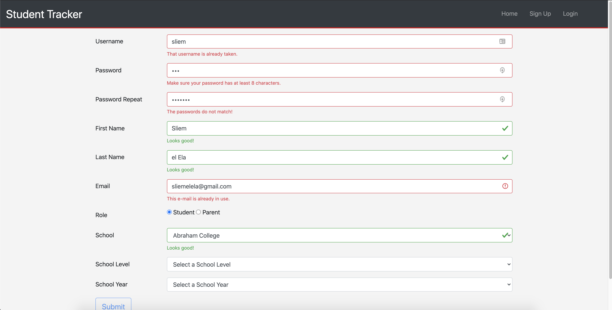

In the signup page, we check whether the filled in information is valid (e.g. unique username, safe enough password etc.) using AJAX requests using the routes `usernamecheck` -- `emailcheck` in the table. After everything is valid, the submit button is being enabled again (since it was disabled from the start). 
The login page (`\login`) looks similar and is very self-evident. If users are logged in, the "logout" will appear in the navigation bar, which a user can click to logout (`\logout`).

### Portal routes
For the portal routes we have used the following routes

| Route                                                	| Description                                                      	| Note                                   	|
|------------------------------------------------------	|------------------------------------------------------------------	|----------------------------------------	|
| `/portal`                                            	| Admin portal                                                      | List of users / change permissions     	|
| `/portal/update`                                     	| Route for updating information from users from admin             	|                                        	|
| `/portal/tutor`                                      	| Tutor portal                                                      | List of students / change limited data 	|
| `/portal/tutor/update`                               	| Route for updating information from students from tutor password 	|                                        	|
| `/portal/parent`                                     	| Parent Portal                                                     | List of children that parent can visit 	|
| `/portal/student/<int:userID>`                       	| Student Portal                                                    | Add courses / parents. View graphs     	|
| `/portal/<int:userID>/addfamily`                     	| Route that adds relations between students and parents           	| Think of a Facebook friendship request 	|
| `/portal/pending`                                    	| Route for accepting / denying / deleting relation (requests)     	|                                        	|
| `/portal/student/<int:userID>/addcourse`             	| Route for adding a course                                        	|                                        	|
| `/portal/student/<int:userID>/course/<int:courseID>` 	| Course Portal                                                     |                                        	|
| `/portal/student/<int:userID>/addgrade`              	| Route for adding grade                                           	| This route calculates a new mean       	|
| `/portal/student/<int:userID>/updategrade`           	| Route for updating/deleting grade                                	| This route recalculates all the means  	|

#### Admin Users
If you are logged in, and you are an admin user, you are met with the following page (`/portal`)

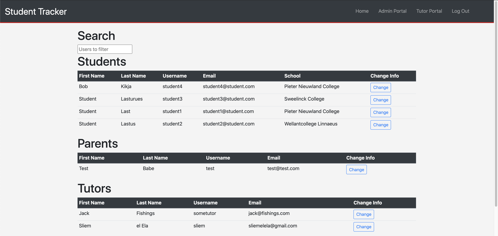

As you can see you have four separate tables with a list of all users. If you click on the row containing the information of a user (student/parent), then you will be redirected to their profile. Using the search functionality on the top left, you can search for specific users using every keyword (searchtable.js):

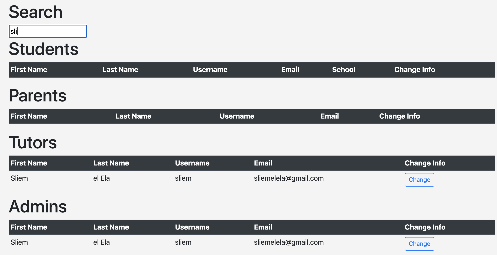

You can also change user information by clicking on "change" for a row of the user (most right column) (`/portal/update`):

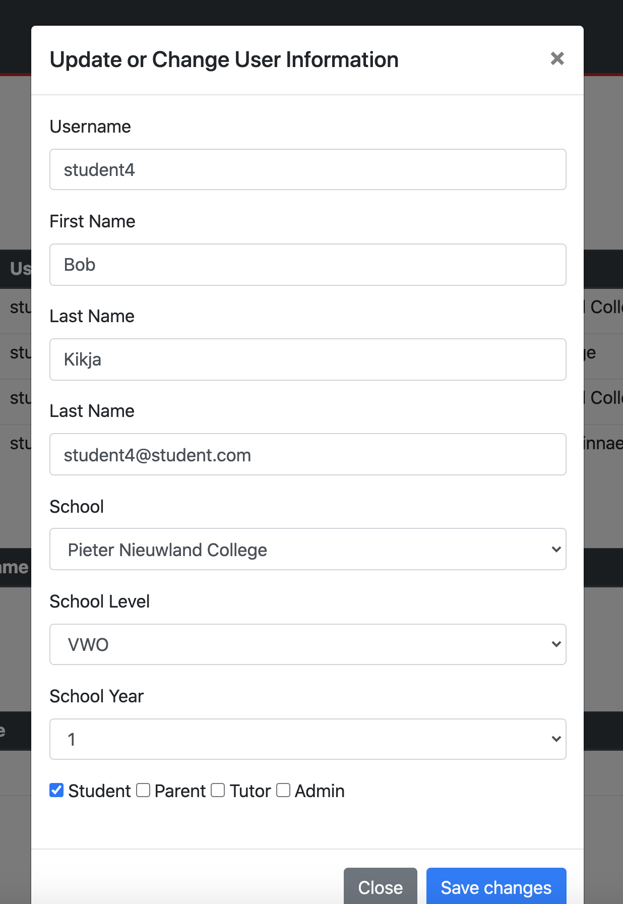

### Tutor Portal
If you are logged in, and you are an tutor user or you are an admin that visits the tutor page, you are met with the following page (`/portal/admin`)

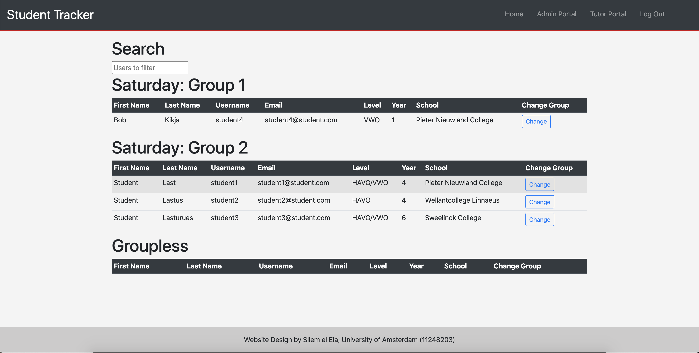

As you can see there are multiple lists of students, each belonging to a group. You can search for students using the top left search bar in a similar fashion as with the search functionality in the admin page. And also in a similar fashion, you can change the information, but this is limited (`/portal/tutor/update`): 

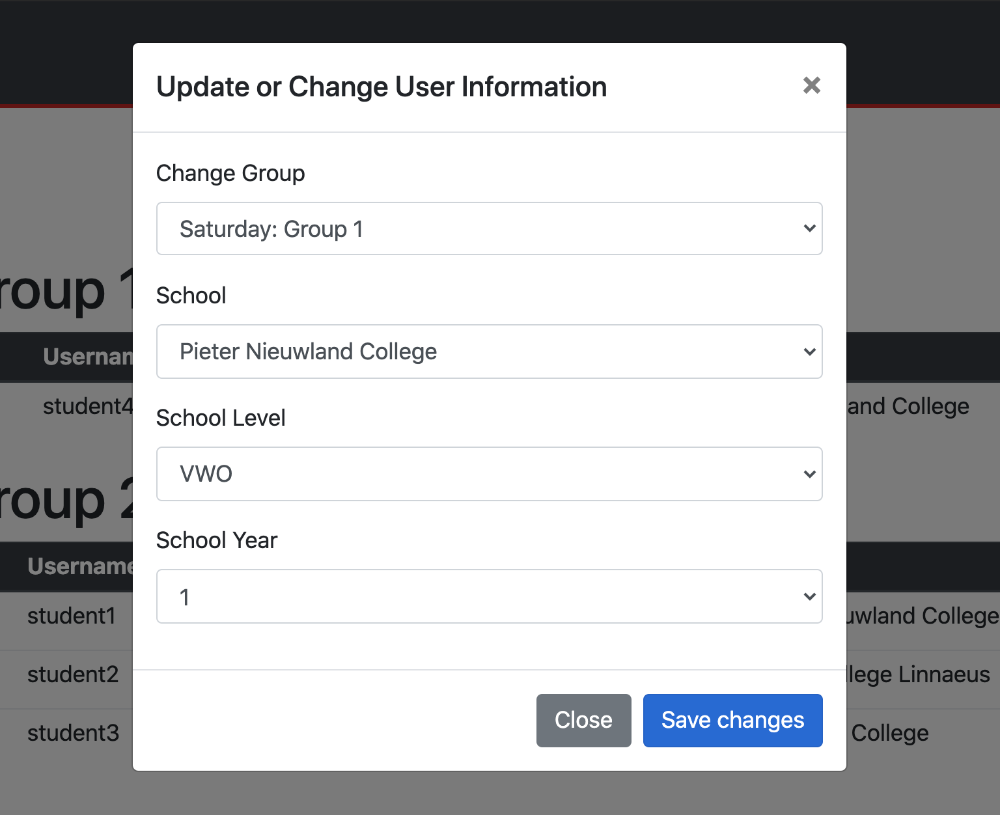

You do however have the power in the tutor portal to reallocate students to different groups. 

### Parent Portal
If you are logged in, and you are an parent user or you are an admin that visits the parent page, you are met with the following page (`/portal/admin`)

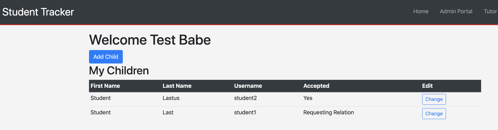

As you can see there three type of children: 
- Accepted children (yes)
- Not Accepted children (no)
- Children that are requesting relations

As a parent you can only view student / children profiles that have accepted you (and you accepted them) by clicking on the appropriate row. 
You can naturally add a new relation by clicking "Add Child" (`/portal/<int:userID>/addfamily`). When a relationship is requested, and you click on "change", you will see the following modal:

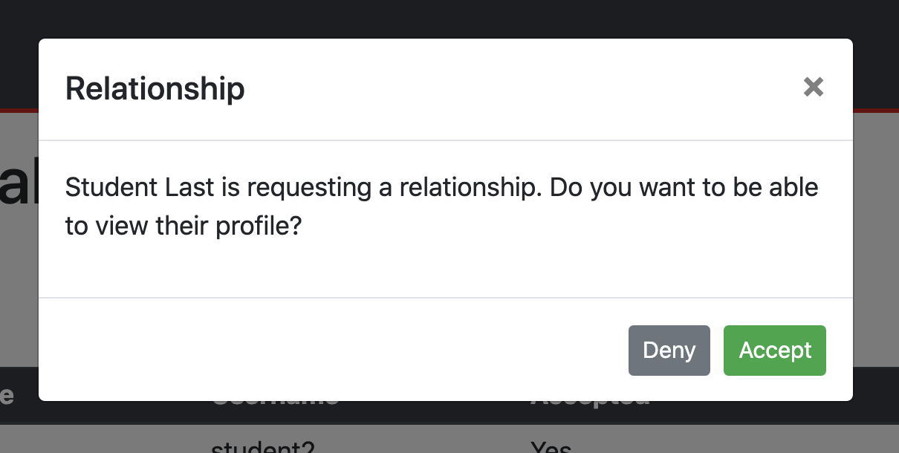

From here you accept / deny the relationship request (`/portal/pending`). If you click on "change" in all the other cases, you are presented with the modal (`/portal/pending`):

# Design of the Student Tracker application

To understand to context in which this document was written, we first the reader to README.md.

In this document we elucidate on which features of this application are going to be implemented to make it a minimum viable product and we will also expand on the user interface sketches as given in the document README.md. Also, the preliminary database design is going to be treated after which we conclude with a list of (external) data sources / APIs that we might want to include in this application. 

## Main Features 
The first main feature of this application is that students can add / delete / update grades. These grades will be summarized with the help of graphs (per course). 
The second feature of this application is that the tutors can keep track of the student absences.

The properties of the grades will be discussed in the database design.

### Extra Features
If time permits, we may want to add 
- Blog Posts such that tutors and administrators can leave messages on the application for the students / parents (e.g. vacation days etc.).
- Implementation of more grading systems.
- Implementation of the difference between a regular test and school / central exam test.
- Implementation of a multi-language website (English and Dutch).
- Implementation of a calendar system, to see which students correspond with which times.

These (extra) features were already listed in the README.md document. We have not included these features in the preliminary database design. 

## User Interface

When a user first visits the web application, the user will be met with a home page. Depending on who is logged in, the home page may have different URL's in the navigation bar as seen by the sketches down below:

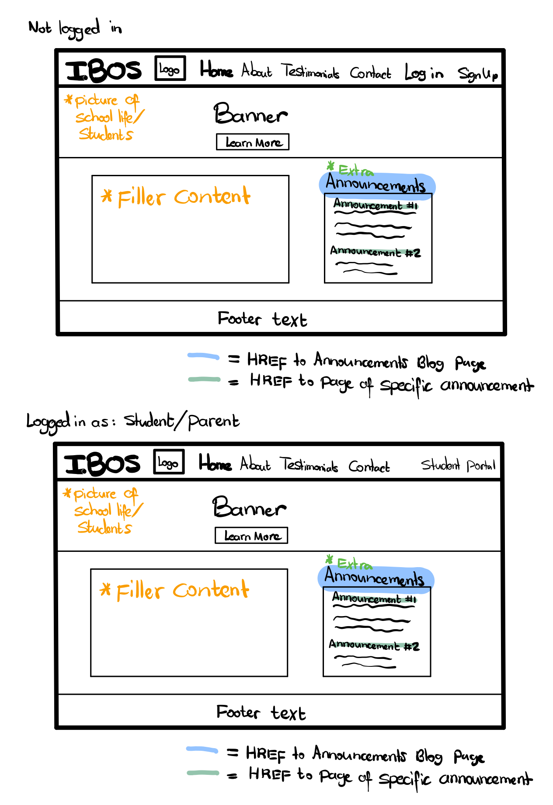
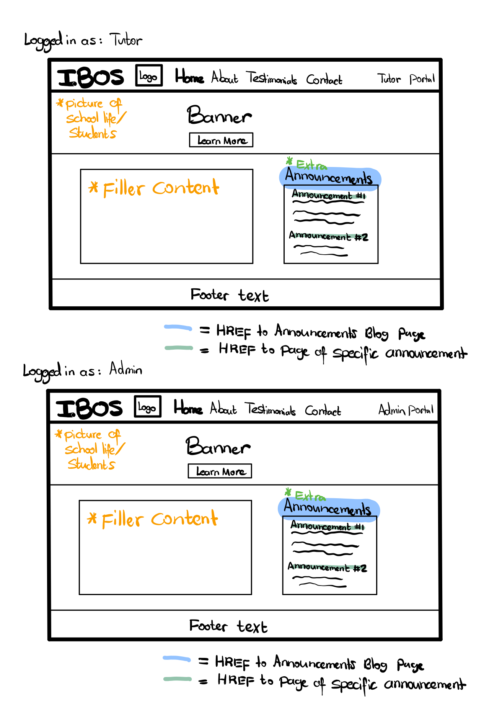

If time permits, we may add a contact page with a contact form and an embedded google map as you can see down below:
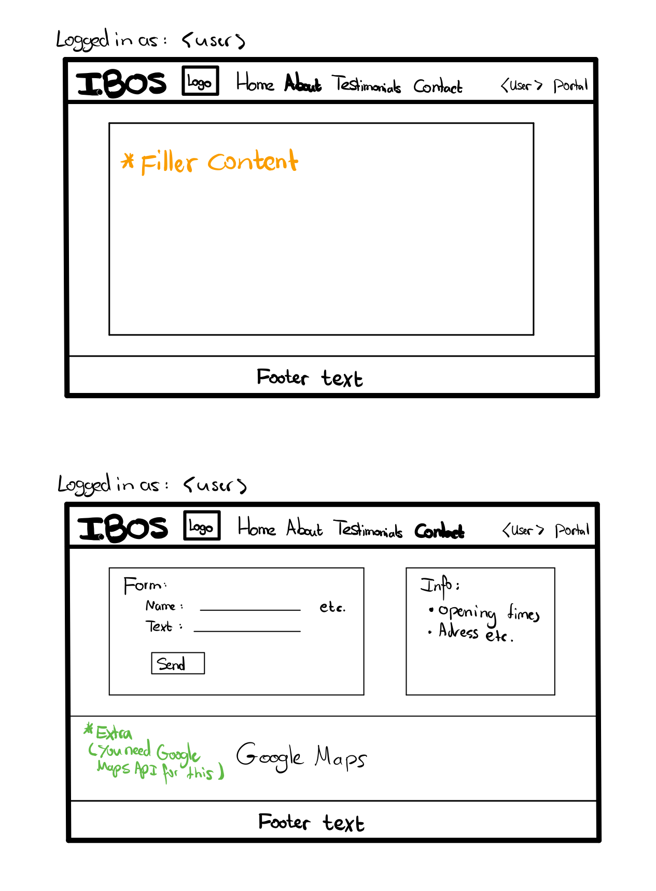

If you are logged in (or have just signed up), you have access to a portal. The administrators and tutors can see the list of students, while a student can view only their own page. Parents can also see a list of students, but that list is limited to their own children.

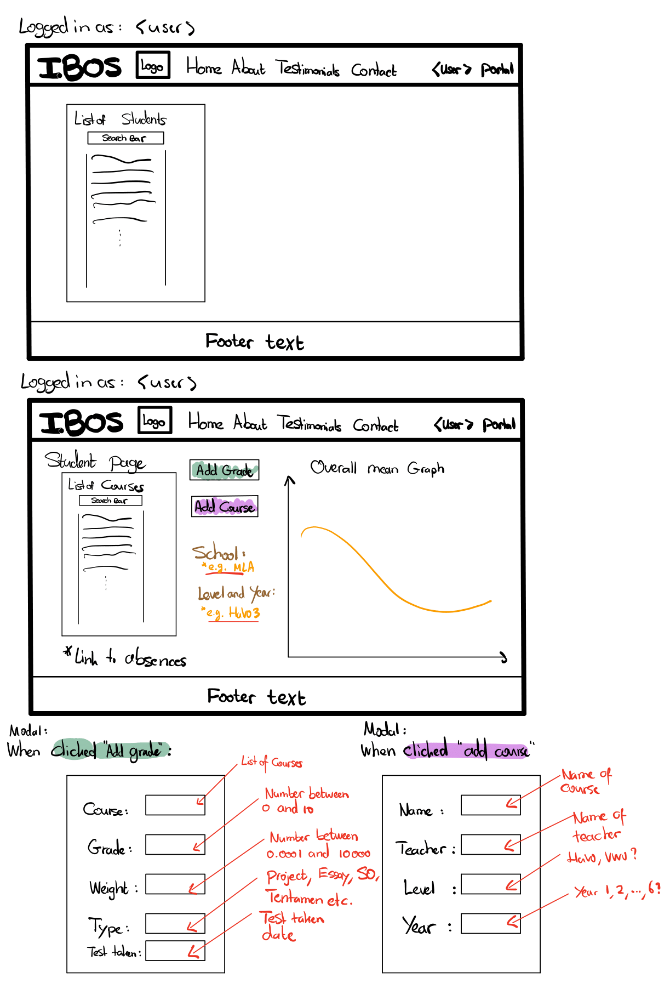
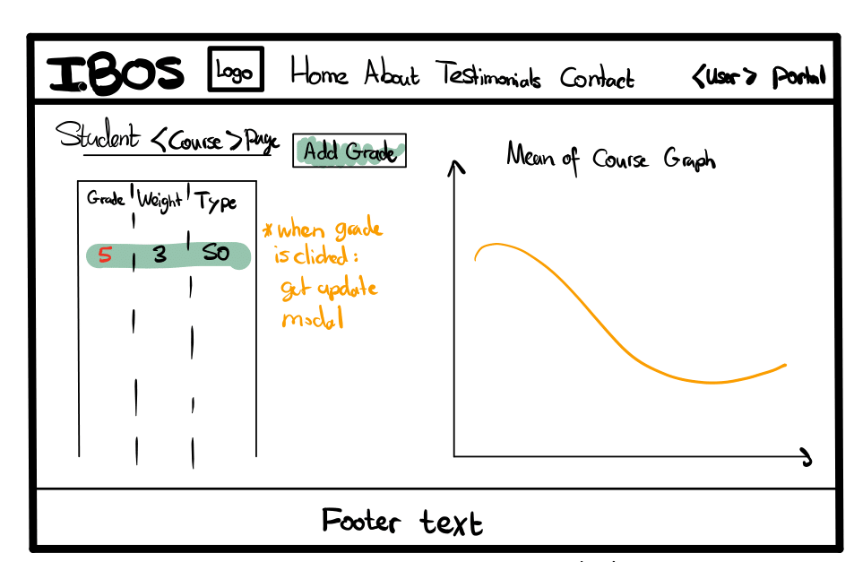

All the other features are self-evident from the above sketches (like adding grades via modals etc.). 

## Database Design 
The preliminary design (UML diagram) of the database can be found below. In this diagram FK is shorthand for "Foreign Key" and PK is shorthand for "Primary Key".
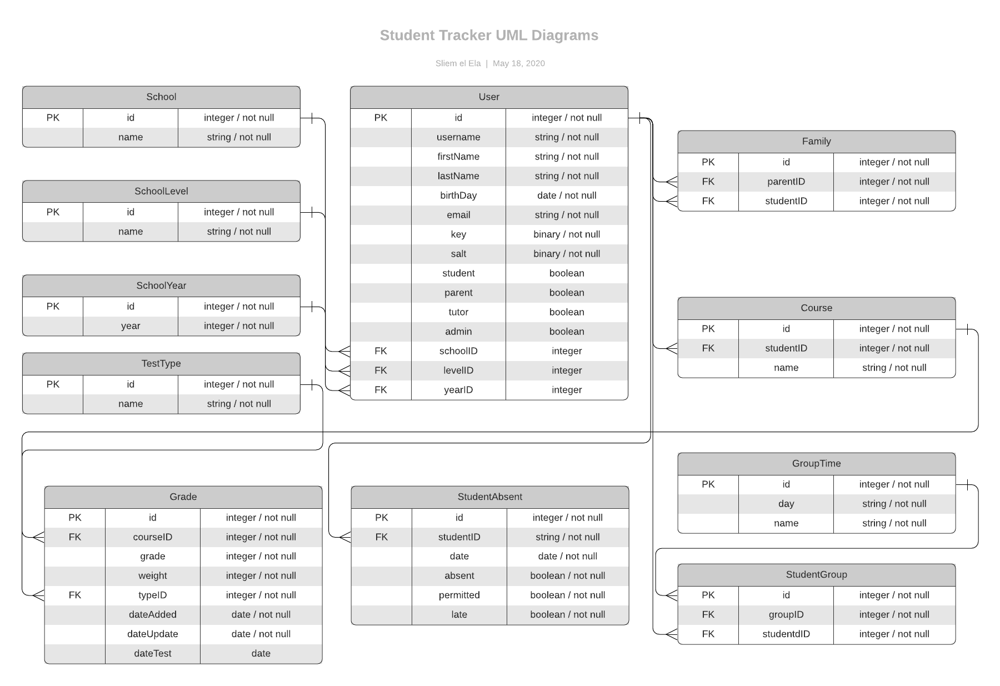

## List of APIs
For the minimum viable product, in principle, there is no need to use any external data sources or APIs. However, there exists a Magister API that may be compatible in such a way that all grades could be automatically entered (provided that the student has authenticated the transmission between Magister and this application). 
The problem is that the Magister API documentation does not provide sufficient information regarding the implementation with Python as it seems to lean more to an implementation with PHP, which we will not use in this application. 

For the demonstration of this product, it may be handy to compose a file that automatically imports dummy students / parents and grades / absences into our database. 

Lastly, as we have said before, if time would permit it, we would like to also embed a google map in the contact page. For this, the Google Maps API would be needed. 

## Updated database design 
The updated design (UML diagram) of the database can be found below. In this diagram FK is shorthand for "Foreign Key" and PK is shorthand for "Primary Key".
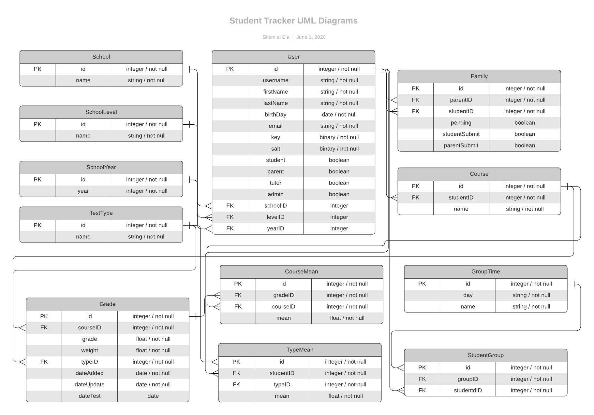

