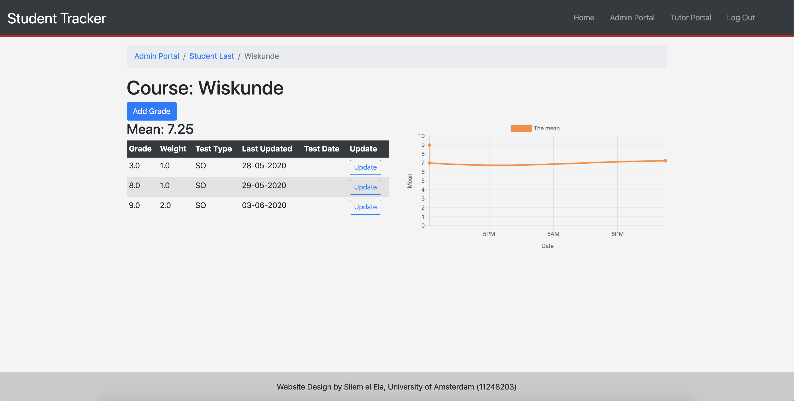

# Design of the Student Tracker application
In this document we will first discuss the different routes that we use in the application while we give an overview of the functionality, after which we introduce the POSTGRESQL database design to support these routes. For the full context we first reccomend reading README.md. 

This application supports four kinds of users:
- Admins: Has the ability to access all profiles of all students / parents. Can also change properties of all the other users.
- Tutors: Has the ability to access all profiles of students. Can change limited amount of properties of students.
- Parents: Has the ability to access student profiles that accepted their relationship request.
- Student: Has the ability to add courses, add grades to courses and add parents to their profile. 

## Routes 
This application is subdivided into two parts: the general routes and the portal routes. 
In the general routes we provide a way for new users to interact with the website and give them the possibility to sign in / login / logout, while the portal routes are used to support the functionality that we described above of the four different users in the application.

### General routes
For the general routes, we have used the routes
| Route                      	| Description                                          	| Note                                 	|
|----------------------------	|------------------------------------------------------	|--------------------------------------	|
| `/`                        	| Landing page / Home page                             	|                                      	|
| `/signup`                  	| Page for signing up                                  	|                                      	|
| `usernamecheck`            	| Route for checking username                          	| Output is JSON used for AJAX request 	|
| `/passwordcheck`           	| Route for checking password                          	| Output is JSON used for AJAX request 	|
| `/passwordcrossvalidation` 	| Route for checking if password and password coincide 	| Output is JSON used for AJAX request 	|
| `/emailcheck`              	| Route for checking if email is unique                	| Output is JSON used for AJAX request 	|
| `/login`                   	| Page for logging in user                             	|                                      	|
| `/logout`                  	| Route for logging out user                           	|                                      	|

where we focus on the ability for the user to visit the website (landing page), sign up and loggin in/out.
New users automatically go to the landing page (`\`) 

after which users can sign up for the first time using the route `\signup`: 

In the signup page, we check whether the filled in information is valid (e.g. unique username, safe enough password etc.) using AJAX requests using the routes `usernamecheck` -- `emailcheck` in the table. After everything is valid, the submit button is being enabled again (since it was disabled from the start). 
The login page (`\login`) looks similar and is very self-evident. If users are logged in, the "logout" will appear in the navigation bar, which a user can click to logout (`\logout`).

### Portal routes
For the portal routes we have used the following routes

| Route                                                	| Description                                                      	| Note                                   	|
|------------------------------------------------------	|------------------------------------------------------------------	|----------------------------------------	|
| `/portal`                                            	| Admin portal                                                      | List of users / change permissions     	|
| `/portal/update`                                     	| Route for updating information from users from admin             	|                                        	|
| `/portal/tutor`                                      	| Tutor portal                                                      | List of students / change limited data 	|
| `/portal/tutor/update`                               	| Route for updating information from students from tutor password 	|                                        	|
| `/portal/parent`                                     	| Parent Portal                                                     | List of children that parent can visit 	|
| `/portal/student/<int:userID>`                       	| Student Portal                                                    | Add courses / parents. View graphs     	|
| `/portal/<int:userID>/addfamily`                     	| Route that adds relations between students and parents           	| Think of a Facebook friendship request 	|
| `/portal/pending`                                    	| Route for accepting / denying / deleting relation (requests)     	|                                        	|
| `/portal/student/<int:userID>/addcourse`             	| Route for adding a course                                        	|                                        	|
| `/portal/student/<int:userID>/course/<int:courseID>` 	| Course Portal                                                     |                                        	|
| `/portal/student/<int:userID>/addgrade`              	| Route for adding grade                                           	| This route calculates a new mean       	|
| `/portal/student/<int:userID>/updategrade`           	| Route for updating/deleting grade                                	| This route recalculates all the means  	|

#### Admin Portal
If you are logged in, and you are an admin user, you are met with the following page (`/portal`)

As you can see you have four separate tables with a list of all users. If you click on the row containing the information of a user (student/parent), then you will be redirected to their profile. Using the search functionality on the top left, you can search for specific users using every keyword (searchtable.js):

You can also change user information by clicking on "change" for a row of the user (most right column) (`/portal/update`):

####  Tutor Portal
If you are logged in, and you are an tutor user or you are an admin that visits the tutor page, you are met with the following page (`/portal/admin`)

As you can see there are multiple lists of students, each belonging to a group. You can search for students using the top left search bar in a similar fashion as with the search functionality in the admin page. And also in a similar fashion, you can change the information, but this is limited (`/portal/tutor/update`): 

You do however have the power in the tutor portal to reallocate students to different groups. 

#### Parent Portal
If you are logged in, and you are an parent user or you are an admin that visits the parent page, you are met with the following page (`/portal/admin`)

As you can see there three type of children: 
- Accepted children (yes)
- Not Accepted children (no)
- Children that are requesting relations

As a parent you can only view student / children profiles that have accepted you (and you accepted them) by clicking on the appropriate row. 
You can naturally add a new relation by clicking "Add Child" (`/portal/<int:userID>/addfamily`). When a relationship is requested, and you click on "change", you will see the following modal:

From here you accept / deny the relationship request (`/portal/pending`). If you click on "change" in all the other cases, you are presented with the modal (`/portal/pending`):

#### Student Portal
If you are logged in as a student, or as another account that is permitted to visit this student's profile, you are met with the following page:

From here you can "Add course" which will render a modal in which you can simply type the course name which will add the course to your list of course (`/portal/student/<int:userID>/addcourse`). If you click on a course in the table, you will immediately be redirected to the course page. You can also add a parent in the same way parents can add children (`/portal/<int:userID>/addfamily`) using "Add parent". For the explanation for how this works, visit the section of the Parent Portal. 

##### Courses
When you visit a course page, then you will be met with the following visual:

From here you can add new grades by clicking "Add grade", which will render the following modal (`/portal/student/<int:userID>/addgrade`):

Also you can update / delte existing grades using the "change" button in every row of a grade 

## Database Design 
The database design (UML diagram) of the database can be found below. In this diagram FK is shorthand for "Foreign Key" and PK is shorthand for "Primary Key".

In models.py we subdivide all these tables into three different categories:
- Schools
    - School (*)
    - SchoolLevel (*)
    - SchoolYear (*)
- User relations
    - User
    - Family
    - GroupTime (*)
    - StudentGroup
- Performane
    - Course
    - CourseMean
    - TypeMean
    - Grade

For all the classes / tables with a (*) it is expected that you have imported the relevant information into these classes before using this application (for example by using flask-admin).

## Code Context
First, to calculate the mean of any course, we should use:

,

where  represent the grades and  represents the weight of the grade. 

But let us say you have 100 grades, which correspond to 100 means generated in different times.
Now if you want to change the third grade, you need to recalculate the third mean, but also all the means after that untill the 100th again. One way could be that you have to recalculate every grade with formula above by using all the grades before it. The problem with this is that the amount of summations you have to do this way can blow up very quickly (quadratically).

The way to circumvent this problem is to make a new formula that calculates the mean given the old mean and the total weights of the grades. To derive this formula, note that 

where  represent the the deleted grade and weight respectively, and  the new added grade and weight respectively (since the idea is that updating a grade is equivalent to deleting and adding a new grade). If you only delete a grade, then we simply set .

