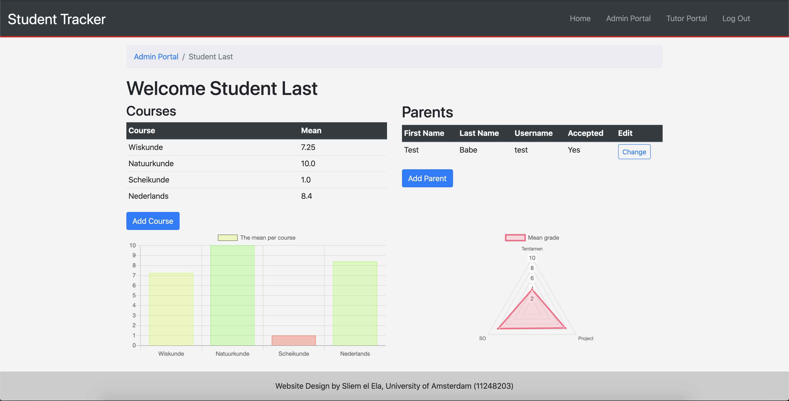
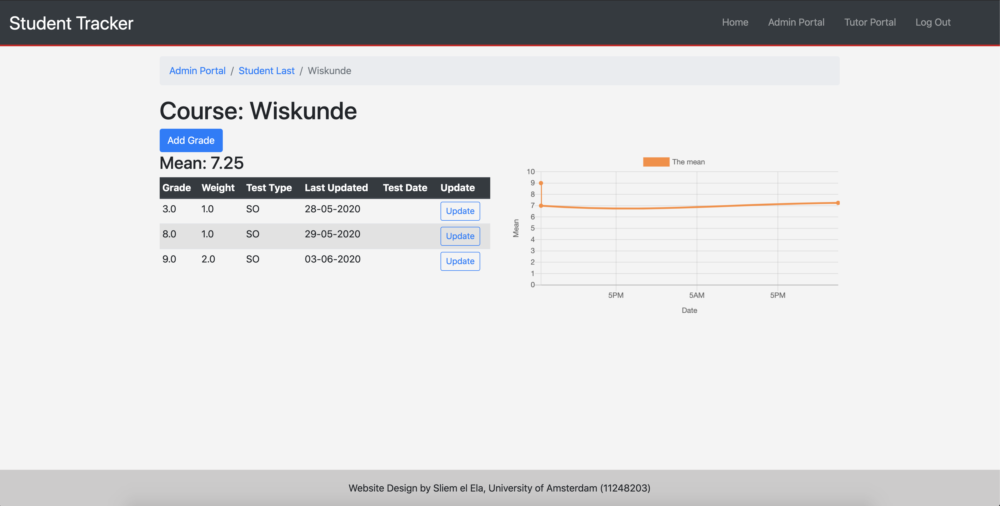

# Student Tracker

A lot of tutor companies (including the one I am working in) want to keep track of the results of their students. 
This application provides a way for students / parents and the tutors to see what those results are. 
The main feauture of this application is for the students to add their grades (with relevant metadata) to produce graphs about the performance of the students. 
Below you can see two pictures of what the application may look like in action:

## Problem statement

In the tutor company IBOS, the results/grades of the students are tracked in the old fashioned way: with paper. Because of this, it is generally hard to see whether there is any significant change in the actual performance of the student. Also, with paper comes the problems of physical storage which we immediately omit by implementing this system.
Also, the company never had a coherent way to keep track of the student absences.

## Solution description

In this application, there are four kind of accounts: student, tutor, parents and administrators. Students can give permission for other parent accounts to view their results and the corresponding analysis (graphs). Students can not view other student their results and parents can only view results they are being permitted to see. Tutors can access all student accounts etc., but can not (for example) view the administrator page and change all the properties of the users in the website. Administrators can access every route, can change roles of already existing accounts and are the only ones who can make tutor accounts.

The first main feature of this application is a way to add the grades / delete grades / change grades, after which we want to be able to analyze these results.
What makes this application powerful is that you can update the your grades and delete graphs and all the means that were calculated will be transformed appropriately. All the graphs will naturally automatically reflect these changes. The graphs we included are:
- A timeseries graph of the mean (per course);
- A bar graph to view all the means of all courses;
- A radar graph that shows the mean of each test type over all courses.

### Solutions by existing apps

- Microsoft Excel: An argument could be made to keep track of the results using Microsoft Excel, but that entails a non-user friendly environment for both students/parents and new tutors that are not familiar with Microsoft Excel. 
- Magister: At virtually any school in The Netherlands, the application "Magister" is used to keep track of the performance of the students. The problem with Magister is that you can not properly see that changes in performance of the students, because the only thing that "Magister" keeps track of are the actual grades. There are no relevant summaries included that may guide or help the tutors or teachers. Magister is good for storing grades, but not handy for any meaningful analysis. Besides this, it would not be practical (or even ethical) to ask for all the login information of all the students such that the tutors can view  

## Languages and utilities
This application is going to be run on a flask server. For this reason, we use:
- Python 3.x
- Flask 
    - flask-login
    - flask-admin

For storing data we use a POSTGRESQL Database hosted by Heroku, which we manage via migrations in a python file. 
We will also use Javascript to handle requests that can be solved on the client-side and also for the implementation of AJAX (for the sign up page). 

## Screencasts
I have made two screencasts:
- The first one was done on Friday, 29th of May: https://photos.app.goo.gl/vNkYnZBMSacQoRHZ9. 
- The second one was done on Sunday, 31st of May: https://photos.app.goo.gl/H4CBw4gsnL8jZ7QT8

The second version is more structured and shows all the feautures with the updated design (with all the buttons and right navigation). I have provided the first screencast as well, such that the instructor can see that there were no major changes made during the span of these two days (since this was not permitted). 

